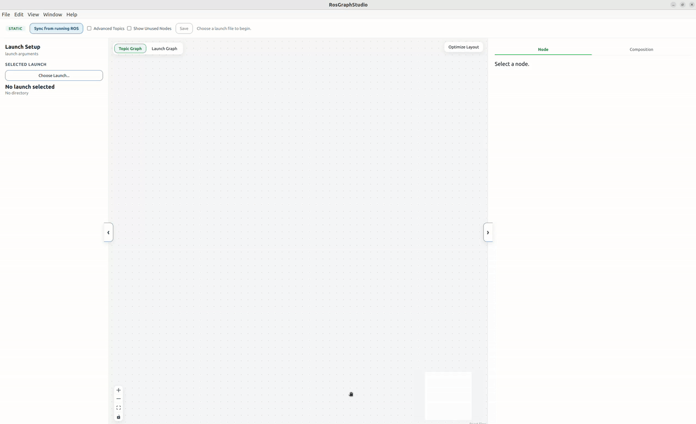
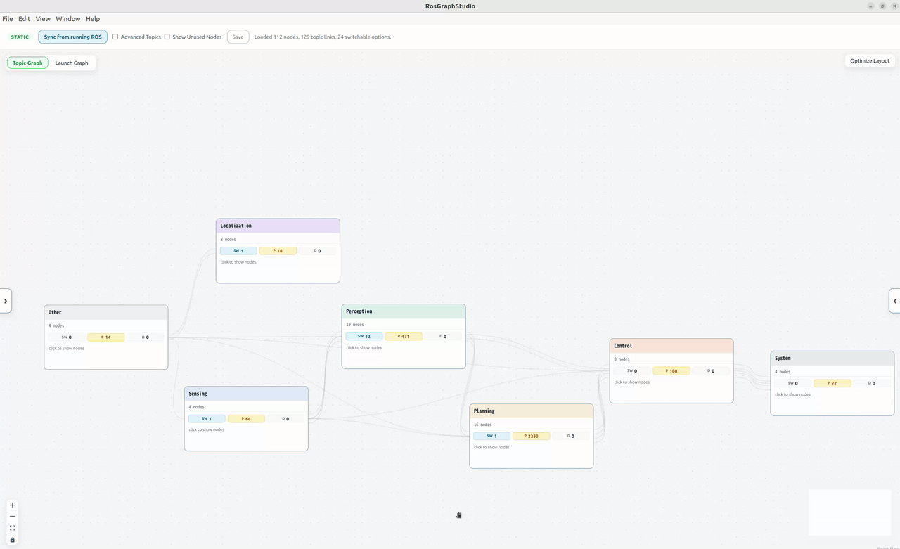
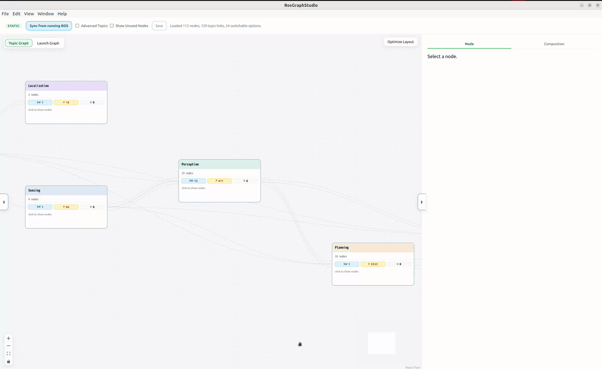
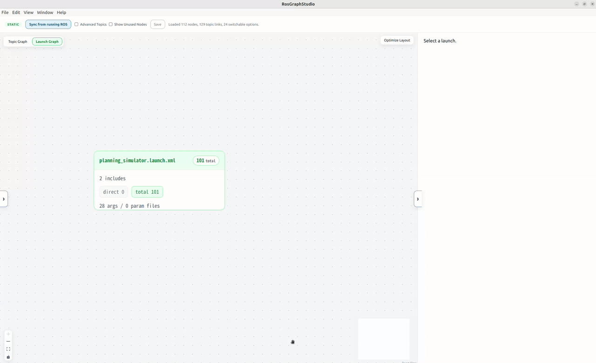

# AutowareGraphStudio

A desktop GUI application for visualizing and editing Autoware's launch configurations and running nodes/topics as a graph.

- **Launch Graph**: Displays the include relationships of `.launch.py` files as a graph
- **Node Graph**: Displays the node/topic connection relationships of a running ROS system as a graph
- **Parameter editing**: Change and apply static / dynamic parameters from the GUI
- **Node editing**: Toggle enable/disable, replace implementation (Swap), add nodes, remap topics
- **Exporting configurations**: Output the edited content to the selected output root's `latest/` directory (the original `src` / `install` are left unchanged)

## Installation

Install the `.deb` file on an Ubuntu PC.

```bash
sudo apt install ./AutowareGraphStudio_0.1.0_amd64.deb
```

To uninstall:

```bash
sudo apt remove autoware-graph-studio
```

### Requirements

- ROS 2
- `rosbridge_server`

## Launching

You can start **AutowareGraphStudio** from the application list.
To launch it from a terminal, run the following.

```bash
autoware-graph-studio
```

Once the GUI is running, select an entry launch from **Choose Launch...** on the left side of the screen. After selection, the Launch Graph / Node Graph are loaded automatically.

## Basic Operations

### Screen layout

The AutowareGraphStudio screen is divided into four main areas.

- **Top toolbar**: Performs runtime sync, display options, and saving of nodes/parameters.
- **Left panel (Launch Setup)**: Selects the entry launch and edits launch args.
- **Center graph**: Switch between `Node Graph` and `Launch Graph` to inspect them.
- **Right panel**: View details of and edit the selected node / launch.

### 1. Load a launch

Steps:

1. Open the **Launch Setup** left panel.
2. Press **Choose Launch...**.
3. Select the `.launch.xml` that will be the entry.
4. After selection, the launch args, Node Graph, and Launch Graph are loaded automatically.




### 2. Inspect the graph

Use the toggle at the top center to choose between **Node Graph** and **Launch Graph**.


#### Node Graph

Displays the connection relationships between ROS nodes and topics.

- Clicking a node displays the node details in the right panel.
- Clicking a category node expands the nodes in that category.
- **Collapse category** closes an expanded category.


#### Launch Graph

Displays the include relationships between launch files.

- Clicking a launch expands / collapses its include destinations.
- Selecting a launch displays the details of that launch in the right panel.



### 3. Sync with running ROS

Pressing `Sync from running ROS` fills in nodes and topic wiring that cannot be seen from file analysis alone. While syncing, the button changes to **Disconnect runtime**, and pressing it returns to the file-analysis graph.

#### Sync before editing

From the launch / config files alone, AutowareGraphStudio cannot always tell which parameter belongs to which node, or see topics and nodes that are only decided at runtime. Without syncing, a shared parameter can show up on the wrong node, so editing it may change a different node than you expect.

If a ROS system is running, press **Sync from running ROS** before editing nodes or parameters. Sync reads the real running graph, so each parameter and topic is shown on the node that actually uses it. (Without a running ROS you can still edit from file analysis; it is just less precise.)

Steps:

1. Start Autoware.
2. Press **Sync from running ROS** in the top toolbar.
3. The nodes / publishers / subscribers / topic types of the running ROS are retrieved.

### 4. Edit and save

> **Tip:** If a ROS system is running, **Sync from running ROS** before editing nodes or parameters so your edits target the right node (see [Sync before editing](#sync-before-editing)).

When you edit a node or launch arg, the changes are gathered below the toolbar. The toolbar's `Output` control chooses the output location; AutowareGraphStudio uses a `autoware_graph_studio_overrides` directory there, and pressing `Save` writes the result to `autoware_graph_studio_overrides/latest/`.

Basic flow:

1. Edit nodes, topics, parameters, launch args, and so on.
2. When there are changes, **Unsaved changes** is shown in the top toolbar.
3. A summary of the changes is listed.
4. Pressing **Save** saves them to `autoware_graph_studio_overrides/latest/`. The exact path is shown in the status after saving.
5. Pressing **Reset all** lets you reset all changes.

### Overall operation flow

1. **Choose Launch...**: Select the entry launch.
2. **Automatic loading**: Automatically detect the package index from the entry launch, and load the Launch Graph, Node Graph, switchable options, and the foundation for editing.
3. **Sync from running ROS**: Ensure rosbridge, and retrieve the node list, pub/sub, and topic types of the running ROS. On success, a `runtime` badge is shown.
4. **Editing**: Perform recompose, topic remap, parameter changes, etc. in the right panel.
5. **Automatic update**: When you change a launch arg or a switch, the graph is re-analyzed without any manual operation.
6. **Save**: Write the changes out to `autoware_graph_studio_overrides/latest/`. Internal backups remain in `runs/`.

## Editing Features

In the right panel you can handle the following.

- Implementation replacement (Swap) via launch args
- Disable / Enable of nodes
- Adding nodes (Add Node)
- Topic wiring changes (remap)
- Parameter override (Apply)

#### Swap (implementation replacement)

If there is an arg that controls a node, `Swap (controls this node)` appears, and args for selecting the whole appear in `Switchable Options`.

Steps:

1. Click the target node in the Node Graph.
2. Open the **Node** tab in the right panel.
3. If **Swap (controls this node)** is shown, choose a candidate from the select.
4. When selected, the graph is re-analyzed and the change is added.

Args for switching the whole are changed from **Switchable Options** in the **Composition** tab of the right panel.

#### Disable / Enable (individual ON/OFF)

When you select a node and disable it, it is shown grayed out in the graph.

Steps:

1. Click the target node in the Node Graph.
2. Open the **Node** tab in the right panel.
3. Pressing **Disable node** disables that node.
4. For a disabled node, the button display changes to **Enable node**.
5. Pressing **Enable node** cancels the disabling.

#### Add Node (adding a node)

Add a new node with `Add Node`.

Steps:

1. Open the **Composition** tab in the right panel.
2. Enter the node name, package, and executable in **Add Node**.
3. Press the **Add Node** button.
4. The added node enters the list and is shown in the Node Graph.
5. You can view / delete added nodes from **Added Nodes**.

#### Remap (topic wiring changes)

Open `I/O`, and when you edit the topic name in the Subscriber / Publisher fields, the edges are rewired.

Steps:

1. Click the target node in the Node Graph.
2. Open the **Node** tab in the right panel.
3. Open **I/O**.
4. Click the topic name in `Subscribers` or `Publishers`.
5. Edit the topic name, and confirm with Enter or by moving focus away.
6. The change is added to the list, and the connections in the graph are also updated.

#### Apply (parameter override)

When you open `Parameters` and edit a value, `Apply` / `Reset` are shown. `Apply` adds the change to the list, and `Save` reflects it in the generated launch. If there are no Parameters, this item is not shown.

Steps:

1. Click the target node in the Node Graph.
2. Open the **Node** tab in the right panel.
3. Open **Parameters**.
4. Edit the value of the parameter you want to change.
5. When you change a value, **Apply** / **Reset** are shown.
6. Pressing **Apply** adds the change to the list.
7. If you want to revert the input, press **Reset**.

Notes:

- `now` is a runtime dynamic parameter. After a runtime sync, `ros2 param set` is performed immediately on **Apply**.
- `on restart` is a parameter that requires a restart after saving.
- `on relaunch` is a parameter that is reflected when you relaunch with the exported launch after saving.

### Reflecting changes

When you press `Save`, the edited content is saved to the selected output root's `latest/` directory. The original files are not modified directly.

After saving, the launch command is shown in the status bar. Running that launch with `ros2 launch` starts the system with a configuration that reflects your saved edits.

Past save results remain in the selected output root's `runs/` directory.


### Launch with edits reflected

After `Save`, you can launch with your changes reflected using the following commands.

```bash
source /opt/ros/$ROS_DISTRO/setup.bash
source ~/ros_ws/install/setup.bash

ros2 launch /path/to/autoware_graph_studio_overrides/latest/launch/autoware_graph_studio.launch.py
```
